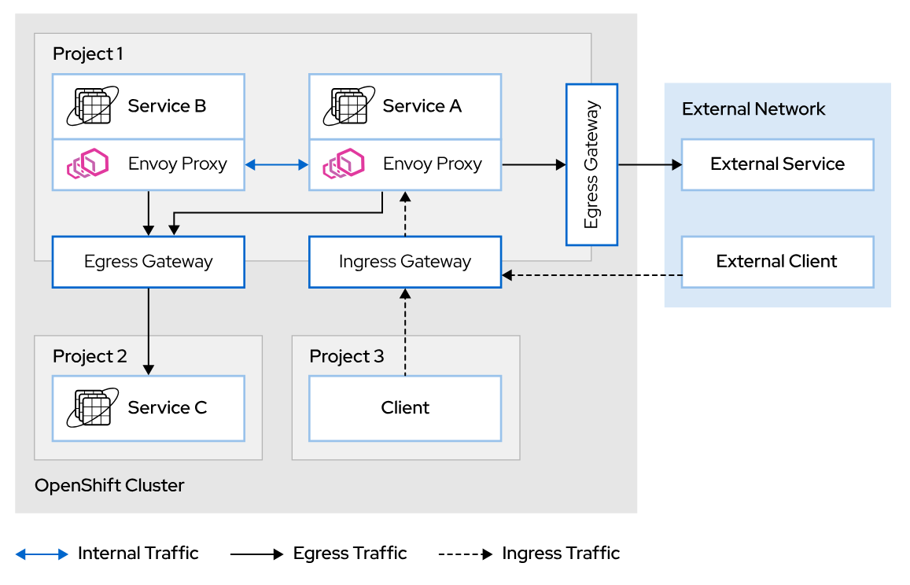

# Microservice intro
## Link
 - [Demo](https://demo.redhat.com/catalog?item=babylon-catalog-prod/sandboxes-gpte.opentour-2022-dach.prod&utm_source=webapp&utm_medium=share-link)
 - [Github](https://github.com/sa-mw-dach/microservice-introduction-gitops)
## Features
- ServiceMess
- GitOps
- Pipelines using ArgoCD and Tekton
## GitOps
### FLows
- Red Hat OpenShift GitOps -> ArgoCD CR created in `example` ns ->  ArgoCD server created -> `AppProject` CR created -> target namespace labeled with `argocd.argoproj.io/managed-by: [ArgoCD namespace]` -> Argo's Application CR created in `example` ns(has to be the same with ArgoCD CR) -> open ArgoCD UI route -> sync(or use autosync)
```
apiVersion: argoproj.io/v1alpha1
kind: Application
metadata:
  name: app
  namespace: user1-gitops
spec:
  ...
  syncPolicy:
    automated: {} #enable auto sync
```
### Run examples
1. Create `Application` resource
```
$ oc apply -f helm-chart-example.yaml
```
- All resources are managed by argoCD so even if we change configs directly, e.g. scale up/down deployment, argocd will reconcile the configs back to the ones on Git

## Tekton pipeline
### Concepts
- Pipeline > multiple tasks(run in parallel, use `runAfter` for sequential tasks) -> multiple steps
- ClusterTask and Task
  - params: inputs
  - results: outputs
  - workspaces: shared storage using pvc
## Service Mesh
- Install service mesh operator
- Create `ServiceMeshControlPlane` resource for control plane
- Create `ServiceMeshMemberRoll` to add namespaces that can be managed by istio
- Add `pod` annotation(not deployment or any other owner) to inject istio proxy sidecar

```
      annotations:
        sidecar.istio.io/inject: "true"
```



### Ingress
The ingress request flow is as follows:

1. A external request enters the cluster.

2. A router instance checks the routing rules implemented by the ingress controller. If a match is found, the request is sent to the ingress gateway service pod (istio-ingressgateway).

3. The ingress gateway service pod evaluates the request against the Gateway configurations to check if the request matches with any configuration. If a match is found, the request is allowed to enter the mesh.

4. The ingress gateway service pod evaluates the VirtualService rules to find the application service pod in charge of processing the request.

5. If a VirtualService rule is matched, the ingress gateway service pod sends the request to the designated pod to process the request.
### Egress
By default, OpenShift Service Mesh allows all egress traffic. If a service invokes another service not managed by OpenShift Service Mesh, the Envoy proxy redirects the requests to the default Istio gateway. By default, this egress gateway forwards the requests to the external network, allowing all external requests to be serviced.
For REGISTER_ONLY egress
```
apiVersion: networking.istio.io/v1beta1
kind: ServiceEntry
metadata:
  name: my-external-service
spec:
  hosts:
  - example.external.com #The hostname where the external service is exposed.
  ports:
  - number: 80
    name: http
    protocol: HTTP
  resolution: DNS #The actual IP of the service must be resolved via DNS by the proxy
  location: MESH_EXTERNAL #MESH_EXTERNAL indicates that the service is external to the mesh.
```
This ServiceEntry configures Istio to allow egress traffic to example.external.com:80 from any service in the mesh.
### Concept
- Istio Gateway acts as an ingress controller for external traffic entering the service mesh.
```
apiVersion: networking.istio.io/v1beta1
kind: Gateway
metadata:
  name: exchange-gw
spec:
  selector:
    istio: ingressgateway
  servers:
    - port:
        number: 80
        name: http
        protocol: HTTP
      hosts:
      - "exchange.example.com" #only allows requests coming to this domain
```
- VirtualService defines where traffic should go based on various criteria.

```
apiVersion: networking.istio.io/v1beta1
kind: VirtualService
metadata:
  name: exchange-vs 1
spec:
  hosts: 2
  - exchange
  gateways:
  - exchange-gw
  http: 3
  - match: 4
    - headers:
        end-user:
          exact: test
    route: 5
    - destination:
        host: exchange
        subset: v2
  - route: #default route
    - destination:
        host: exchange
        subset: v1
```
redirects all requests containing the header end-user and the value test from the exchange service to the subset v2. In any other case, the match condition is not fired so the traffic is redirected to the default destination.
VirtualService binds with Gateway through `gateways` field

- DestinationRule defines how traffic should be handled by the destination services.
```
apiVersion: networking.istio.io/v1beta1
kind: DestinationRule
metadata:
  name: my-destination-rule
spec:
  host: my-svc #service name
  trafficPolicy: #default policy
    loadBalancer:
      simple: RANDOM
  subsets:
  - name: v1 #name of the 1st subset
    labels: #List of label tags used to select the service instances belonging to the subset.
      version: v1
  - name: v2
    labels:
      version: v2
    trafficPolicy: #Traffic policy set at the subset level, overriding the policy set at the service level.
      loadBalancer:
        simple: ROUND_ROBIN
```
then can be used by Virtual Service
```
apiVersion: networking.istio.io/v1beta1
kind: VirtualService
metadata:
  name: my-virtual-service
spec:
  hosts:
    - "*"
  http: 
    - match: 
        - headers: 
          end-user: 
            exact: redhatter #for request that has header end-user having value redhatter
      route: 
        - destination: 
            host: my-svc
            subset: v2
    - route: 
        - destination:
            host: my-svc
            subset: v1
```
Virtual services route traffic to a specific destination, and destination rules operate in the traffic routed to that destination.

The policies defined in destination rules are applied after the routing rules in the virtual services are evaluated. With destination rules you can define load balancing, connection limits, and outlier detection policies.

### ServiceMeshMemberRoll vs ServiceMeshMember
- `ServiceMeshMemberRoll` created in the servicemesh control plane namespace, include all namespaces that should be part of mesh
- `ServiceMeshMember` created in the namespace that needs to be part of the mesh, just a single member and not a list of namespaces like in `ServiceMeshMemberRoll`
- Centralized vs. Decentralized Management: ServiceMeshMemberRoll is a centralized way to manage mesh membership at the mesh control plane level by listing all the member namespaces in one resource. ServiceMeshMember, on the other hand, allows individual namespaces to opt into the mesh in a decentralized manner.
- Scope: ServiceMeshMemberRoll affects multiple namespaces in one declaration, whereas ServiceMeshMember is scoped to a single namespace.
- Control: The creation of a ServiceMeshMemberRoll is typically controlled by administrators of the service mesh, while ServiceMeshMember can be initiated by the administrators of individual namespaces, offering them control over their participation in the mesh.
